# Note: Since everyone has their own tasks that require sudo privileges, we added everyone's public key to the 'ubuntu' username, which already has sudo privileges, instead of granting sudo privileges to each individual.

# TABLE OF CONTENT 
1. Provision Ubuntu Server on AWS.
2. Create User Accounts for All Team Members on the Ubuntu Server.
    **2.1**. Challenges
3. Add User 'Calson' and Share Login Details.
4. Create Groups and Add Members.
5. Create a Directory and File with Specific Content and Permissions.
6. Install Git on the Server.

# Task 1: Provision Ubuntu Server
+ Step 1: Go to AWS cloud website and log in.
+ Step 2: On the left side, click on All Services, under Compute, choose EC2 to create a virtual server.
 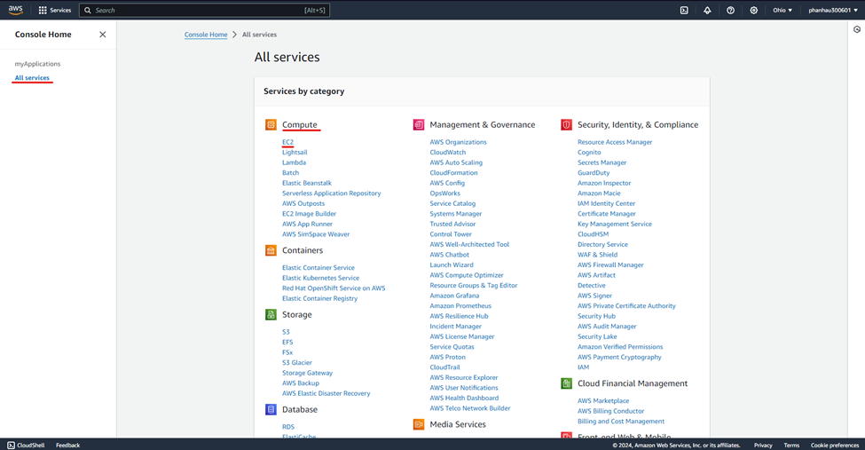
+ Step 3: Then click Launch instance.
+ Step 4: Choose Application and OS Images, then go to Key pair (login) section to be able to connect the server and click Launch instance to create the server. 
 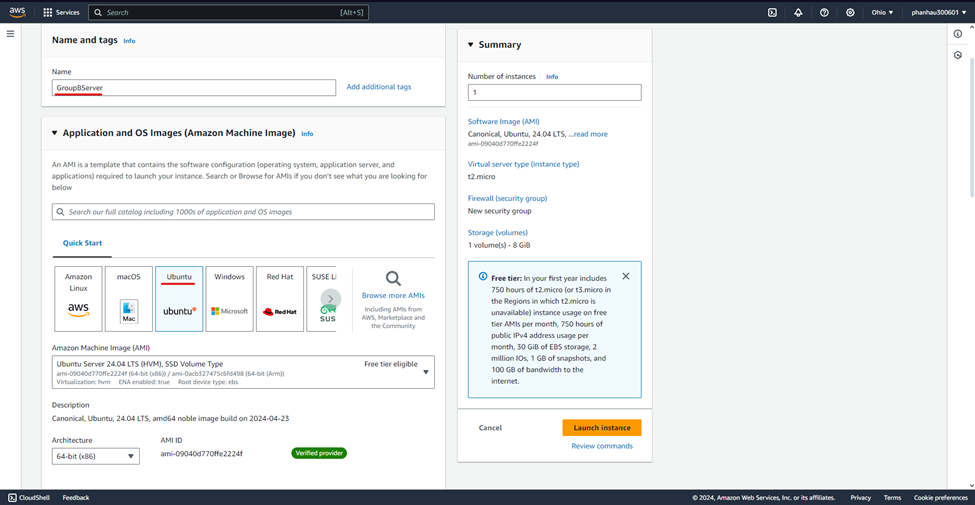
 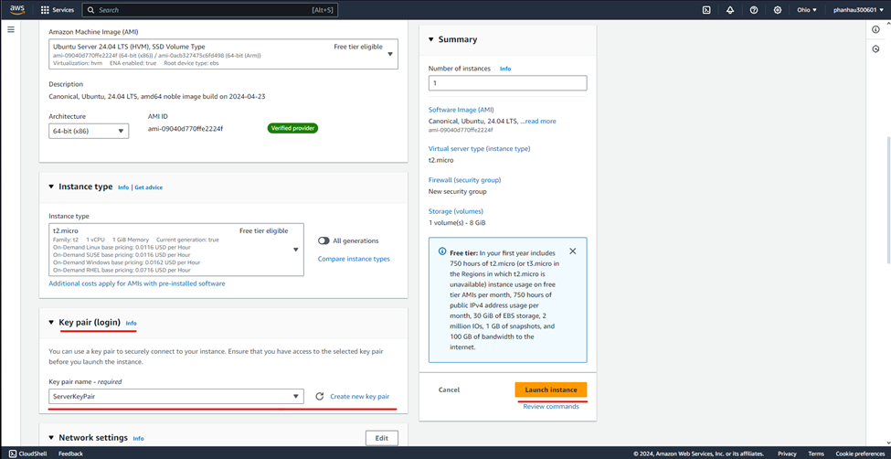
+ Step 5: After creating the instance, type Instances on search bar. It will show the server created. 
 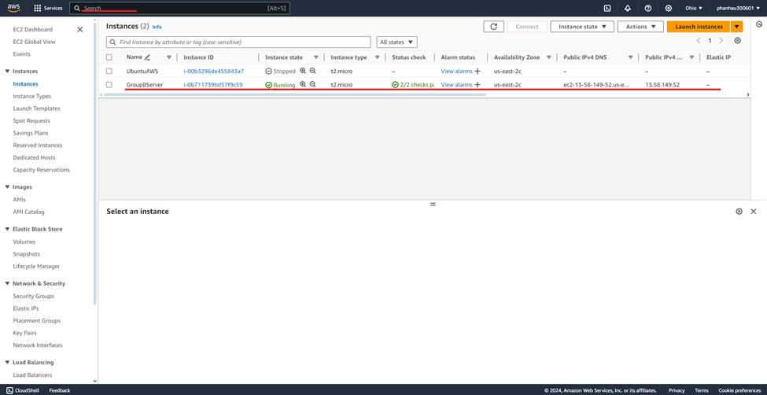
+ Step 6: Click the server, then choose Connect, and then choose SSH client and copy the default command provided. Next, switch to the directory where the private key file is stored. Then, open your Command Line or PowerShell on Windows, the terminal in VSCode, or Terminal on a Macbook. Finally, connect to the server with SSH by entering the command.

# Task 2: Create User Accounts for All Team Members on the Ubuntu Server.
+ Step 1: Create users by running command `sudo useradd <username>`.
 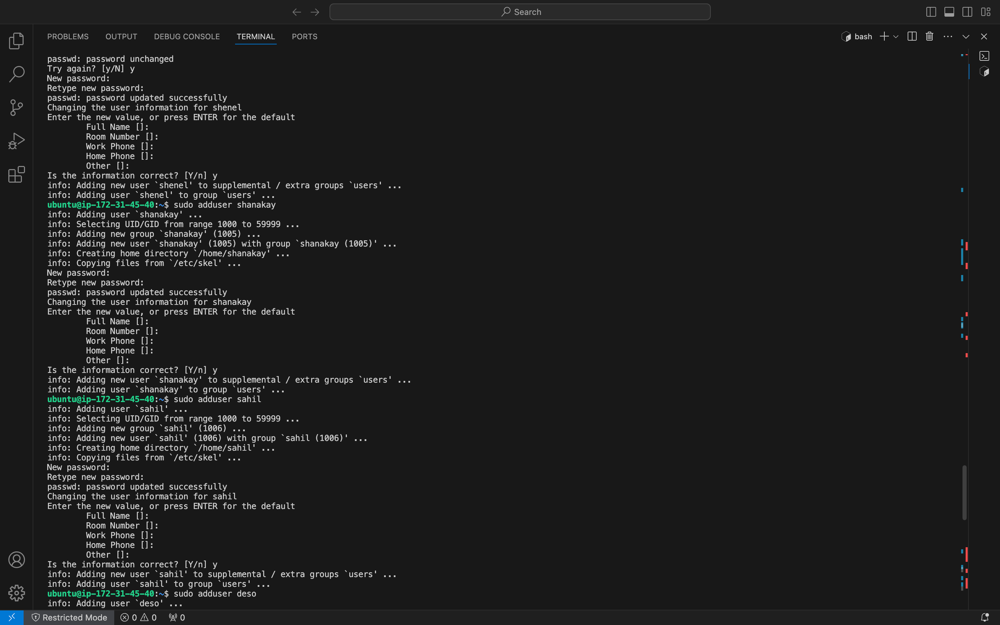
+ Step 2: Add each person's public key to their respective home directory. 
       Run command `sudo -i -u <username>` to switch to the user and their home directory.
       Run command `mkdir -p ~/.ssh` to create .ssh directory.
       Run command `vi ~/.ssh/authorized_keys` to create authorized_keys file where stores public key.
       Run command `chmod 700 ~/.ssh/authorized_keys` to grant permission to user on authorized_keys file.
 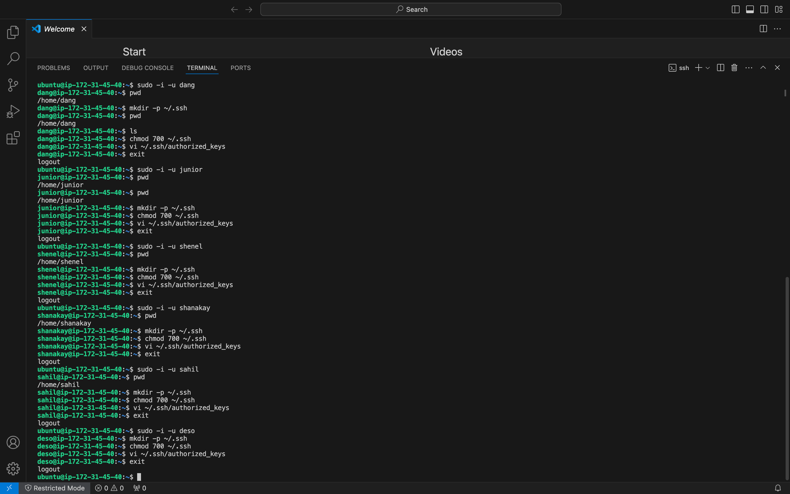
**2.1. Challenges: Everyone encountered difficulties connecting via SSH to their username on the first attempt.**
       **Problem: The issue stemmed from using the incorrect command to switch usernames and their respective home directories.**
       Wrong command: `sudo su <username>`. This command only switches the username but does not change the working directory from Ubuntu's home directory to the user's home directory.
       **Solution: Using the command `sudo -i -u <username>` or `sudo su - <username>` resolves this issue, as it switches both the username and the working directory to the user's home directory.**
 
 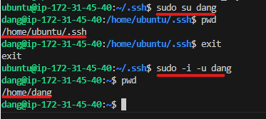

# Task 3: Add User 'Calson' and Share Login Details.
+ Step 1: Logged in on the server using ssh and created a user calson using command `sudo useradd <calson>`.
+ Step 2: Switched user from the ubuntu user to calson user with the following command: `sudo su - calson`.
+ Step 3: Ran the following command `pwd` to verify my present working directory, then ran the command `cd .ssh` to move into the .ssh directory and created a file named `authorized_keys` with the following command: `touch authorized_keys` and `ls` to be sure the file was created.
+ Step 4: Gave permisssion to the file authorized_keys using the following command: `chmod 700 authorized_keys`.
 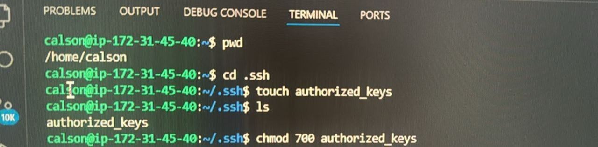
+ Step 5: Opened the file created with a text editor with the following command: `vi authorized_keys`, and pasted the public key generated by the user Calson and closed the edited file, then ran command `cat authorized_keys` to see the key pasted. 
+ Step 6: Switched user back to ubuntu server, then ran the command `vi .ssh/authorized_keys` and pasted calson’s public key.  
 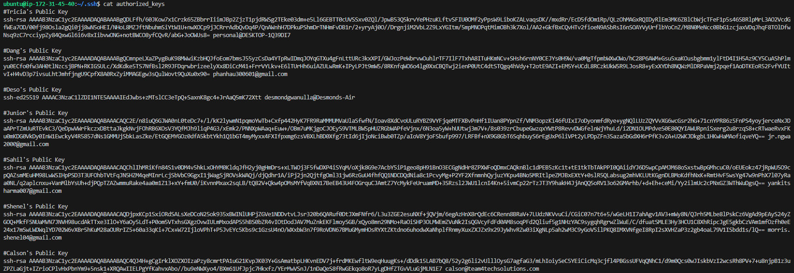

# Task 4: Create Groups and Add Members.
+ Step 1: Log into ssh server.
+ Step 2: Write command `sudo groupadd DevOps-Engineer` to create DevOps Engineer user group.
+ Step 3: Write command `sudo groupadd Cloud-Engineer` to create Cloud Engineer user group.
+ Step 4: To verify groups we created, run the command `gentent group`.
+ Step 5: Finally, to add indivudual users to the groups, run the command `sudo adduser <username> <groupname>` then repeat the same command until every individuals are added accordingly.
 
 

# Task 5: Create a Directory and File with Specific Content and Permissions.
+ Step 1: Create Class6 directory by running command `mkdir class6`.
+ Step 2: `cd class6` to change directory and then `vi Assignment` to create and add content "Welcome to Team4tech Solution"", then save the file with ESC + wq! + Enter.
+ Step 3: `sudo chmod 660 Assignment` to set file permissions to read and write for the user and group, and no permissions for other.
+ Step 4: Run command `sudo chown calson:DevOps-Engineer Assignment` to change the file ownership to Calson user and DevOps-Engineer group. 
  
  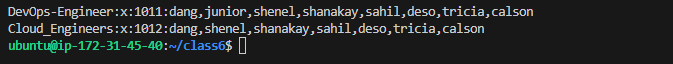

# Task 6: Install Git on the Server.
+ Step 1: `sudo apt update` command is used to ensure the lastest version is installed.
+ Step 2: `sudo apt install git` command to install GIT.
+ Step 3: `git --version` to verify GIT is installed correctly. 
 
 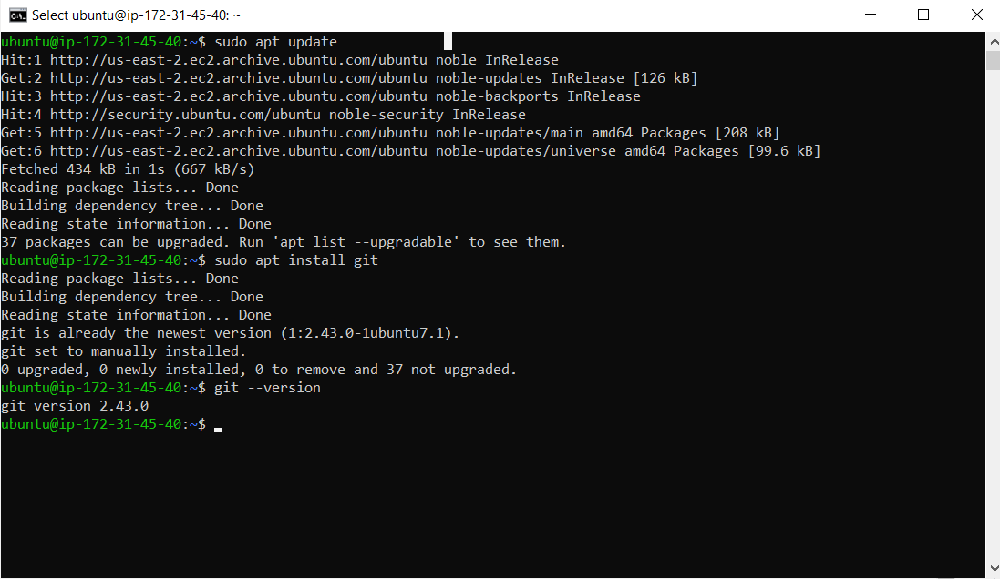
